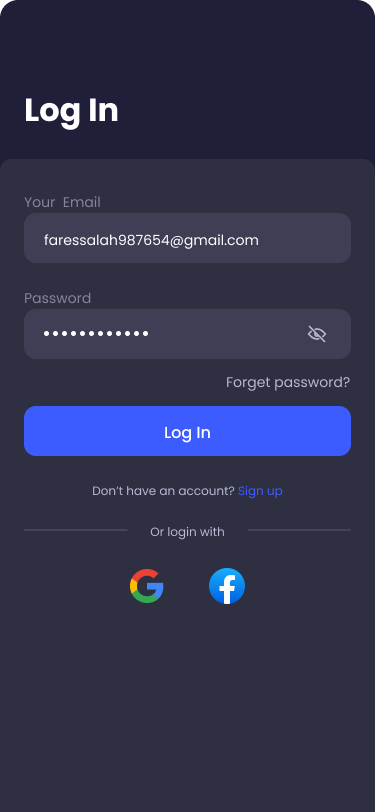
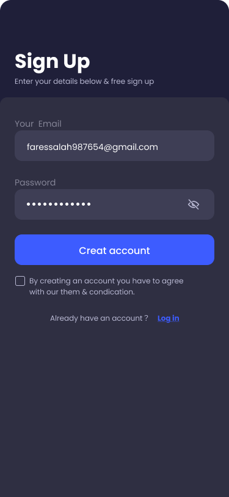

# 📱 Excelerate Inquisit    

**Program:** Excelerate Mobile App Development Internship  
**Team:** Team 35  
**Platform:** Mobile (Flutter)  
**Repository Manager:** Ronitha Sanem  

---    

## 🚀 Introduction    
Excelerate Inquisit is a mobile app designed to extend the Excelerate learning experience beyond the website. It's set up to reflect some parts of the main platform, giving users direct access to their profiles in a more simplified way for faster navigation and a more engaging user experience.  

---    

## 🧩 Core Features    
- **Login & Authentication:** Secure login with email and password (mock data for demo).  
- **Dashboard:** Displays learning plan and enrolled courses, time spent learning, and progress.  
- **Search Button:** Allows users to easily search for courses or available internships.  
- **Message Screen:** Shows notifications and direct messages.  
- **Profile Page:** Displays user info, settings and privacy, help and logout option.
- **Course and Learning Modules:** Displays available courses

---    

## 🧰 Tools & Technologies    
- **Framework:** Flutter  
- **Language:** Dart  
- **Design Tool:** Figma  
- **Version Control:** GitHub  

---

## 🎥 App Demo Video Links
[🎥 Watch App Demo Video](https://drive.google.com/file/d/1tvOYKwBXqjRwf4HtQb6beYSVaaCAoNdf/view?usp=drivesdk)

---

## 📸 Screenshots

### 🔹 Login Screen  

### 🔹 Home Screen  

### 🔹 Course Screen  

### 🔹 Filter Screen  

### 🔹 Notification Screen  

### 🔹 Signup Screen  

### 🔹 Account Screen  

---   

## 📊 System Requirements    
**Functional Requirements:**    
- User authentication (mocked)  
- Dashboards for learners  
- Course & evaluation modules  

**Non-functional Requirements:**    
- Smooth performance  
- Mobile responsiveness  
- Dark mode UI  
- Time zone-friendly notifications  

---    

## 👩‍💻 Contributors    
- **Charissa Sarah** – Team Lead & Proposal  
- **Fares Salah** – Flutter Development & UI/UX (Figma)  
- **Barakat Salaudeen** – PDF Organizer & Content Writing  
- **Ronitha Sanem** – Repository & Documentation  

---    

## 🏁 Conclusion    
Excelerate Inquisit combines usability, accessibility, and interactivity to make mobile learning more intuitive and rewarding.  
This project demonstrates our team’s understanding of full-cycle mobile app development — from UI design to documentation and GitHub collaboration.  
